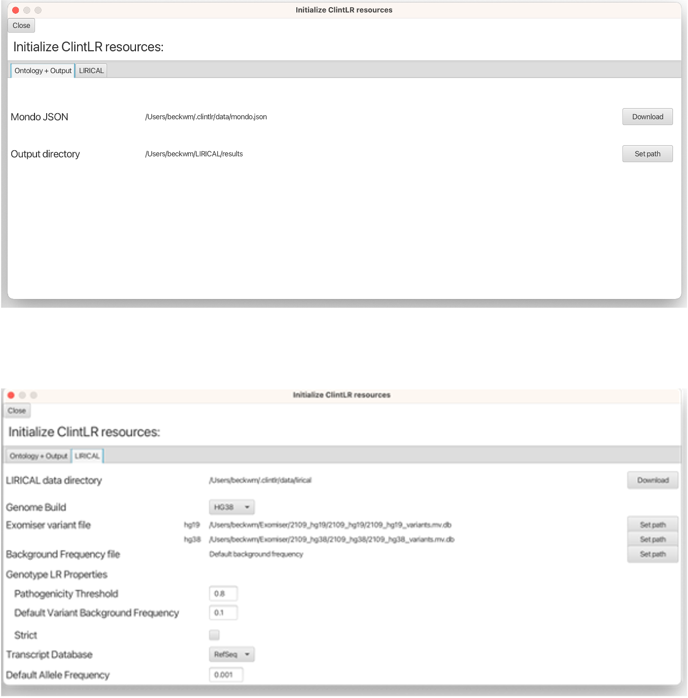

# Setting up ClintLR

## Prerequisites

ClintLR was written with Java version 17 but will compile under Java 17 or higher. If you want to
build ClintLR from source, then the build process described below requires
[Git](https://git-scm.com/book/en/v2) and
[Java Development Kit 17](https://www.oracle.com/java/technologies/downloads/) or higher.


## Installing ClintLR

### Downloading prebuilt JAR file

Most users should use the prebuilt ClintLR executable JAR file.
Executable JAR files for Linux, Mac, and Windows platforms can be downloaded from the
[releases](https://github.com/TheJacksonLaboratory/ClintLR/releases) page. 


### Building from sources

An executable JAR file can also be built from sources. When building from sources, LIRICAL needs to be installed separately. 
Instructions for installing LIRICAL as a library can be found
[here](https://thejacksonlaboratory.github.io/LIRICAL/stable/setup.html#building-to-use-as-a-library).

To build ClintLR from sources, go the GitHub page of [ClintLR](https://github.com/TheJacksonLaboratory/ClintLR), 
and clone or download the project, then build the executable from source with Maven:

```
  git clone https://github.com/TheJacksonLaboratory/ClintLR.git
  cd ClintLR
  ./mvnw clean package
```

We use the [Maven Wrapper](https://maven.apache.org/wrapper/) for building the sources, so installation
of Maven prior to build is *not* required.

The executable jar is located at the *clintlr-gui/target* subdirectory.


## Launching ClintLR GUI

To launch the ClintLR GUI, run:

```java -jar path/to/clintlr/jar```


## Resources Setup

Prior to performing analysis in the ClintLR GUI, the locations of certain resources (the Mondo ontology, output directory, 
LIRICAL data directory, and Exomiser variant files)
need to be specified. This can be done from the Resources interface, accessed from the *File -> Show Resources* menu.
Resources set in this interface are preserved between sessions and saved in a .clintlr configuration folder that is 
created automatically in the home directory.

<figure markdown>
  
  <figcaption>Screenshot of the ClintLR resources interface Ontology + Output tab (top) and LIRICAL tab (bottom)</figcaption>
</figure>

### Ontology + Output
The Mondo ontology and output directory paths are found in the *Ontology + Output* tab.
The Mondo ontology is required to use ClintLR. Clicking
the **Download** button will download and save the latest version of the Mondo ontology to your machine.

**Note:**  There are currently no progress bars for the download buttons, however they are working in the background, and must
only be clicked once.

The output directory refers to a local directory to which the analysis results files will be saved.
This can be set using the **Set Path** button next to the Output directory field.

### LIRICAL 
LIRICAL resources are found in the *LIRICAL* tab.
The LIRICAL data directory refers to the directory that contains
[additional files](https://thejacksonlaboratory.github.io/LIRICAL/stable/setup.html#lirical-data-files) that LIRICAL requires to run.
Similar to the Mondo ontology, clicking
the **Download** button will download and save the LIRICAL files to your machine.

The Exomiser variant files refer to data files from Exomiser that LIRICAL uses to the annotate the VCF file and 
support variant interpretation.
The Exomiser variant database files can be obtained from the [Exomiser download site](https://exomiser.monarchinitiative.org/exomiser/download).
Once the Exomiser files are downloaded, their local paths can be set using the respective **Set Path** buttons.

In the last tested Exomiser release `2309`, the variant database names are:

- **hg38**: 2309_hg38_variants.mv.db
- **hg19**: 2309_hg19_variants.mv.db
