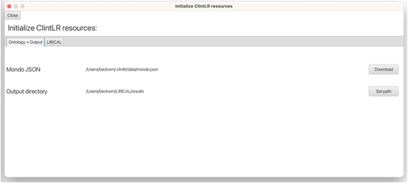

.. _installation:

===============
Setting up ClintLR
===============

ClintLR is a desktop Java application that includes LIRICAL analysis. Therefore, ClintLR requires LIRICAL to be installed.
Instructions for installing LIRICAL can be found `here <https://thejacksonlaboratory.github.io/LIRICAL/stable/setup.html#rstsetup>`_.
Similar to LIRICAL, ClintLR also requires Exomiser to be installed as a library before it can be compiled and built.

Prerequisites
~~~~~~~~~~~~~

ClintLR was written with Java version 17 but will compile under Java 17 or better. If you want to
build ClintLR from source, then the build process described below requires
`Git <https://git-scm.com/book/en/v2>`_ and
`Java Development Kit 17 <https://www.oracle.com/java/technologies/downloads/>`_ or better.

.. note::
  The ClintLR GUI requires JavaFX to run. If your Java installation does not include JavaFX, installations of Java that
  include JavaFX can be found `here <https://www.azul.com/downloads/?package=jdk-fx#zulu>`_

Building from sources
~~~~~~~~~~~~~~~~~~~~~

Go the GitHub page of `ClintLR <https://github.com/TheJacksonLaboratory/ClintLR>`_, and clone or download the project.
Build the executable from source with Maven::

  git clone https://github.com/TheJacksonLaboratory/ClintLR.git
  cd ClintLR
  ./mvnw clean install

We use the `Maven Wrapper <https://maven.apache.org/wrapper/>`_ for building the sources, so installation
of Maven prior to build is *not* required.

Launching ClintLR GUI
~~~~~~~~~~~~~~~~~~

To launch the ClintLR GUI, run:

.. parsed-literal::
  java -jar clintlr-gui/target/ClintLR.jar

Resources Setup
~~~~~~~~~~~~~~~

Prior to performing analysis in the ClintLR GUI, the locations of certain resources (the Mondo ontology, output directory, LIRICAL data directory, and Exomiser variant files)
need to be specified. This can be done from the Resources interface, accessed from the `File -> Show Resources` menu.
Resources set in this interface are preserved between sessions.

    Screenshot of the ClintLR resources interface Ontology + Output tab (top) and LIRICAL tab (bottom)

The Mondo ontology and output directory paths are found in the `Ontology + Output` tab, and LIRICAL resources are found in the `LIRICAL` tab.
If you have a local Mondo ontology file to use, you can set its path using the **Set Path** button. Alternatively, clicking
the **Download** button will download and save the latest version of the Mondo ontology to your machine.

The output directory refers to a local directory to which the analysis results files will be saved.
This can be set using the **Set Path** button next to the Output directory field.

The LIRICAL data directory refers to the directory that contains
`additional files <https://thejacksonlaboratory.github.io/LIRICAL/stable/setup.html#rstsetup>`_ that LIRICAL requires to run.
Similar to the Mondo ontology, a local directory can be specified or the files can be downloaded.

The Exomiser variant files refer to data files from Exomiser that LIRICAL uses to the annotate the VCF file and support variant interpretation.
The Exomiser data files can be obtained from the `Exomiser download site <https://exomiser.monarchinitiative.org/exomiser/download>`_.
Once the Exomiser files are downloaded, their local paths can be set using the respective **Set Path** buttons.