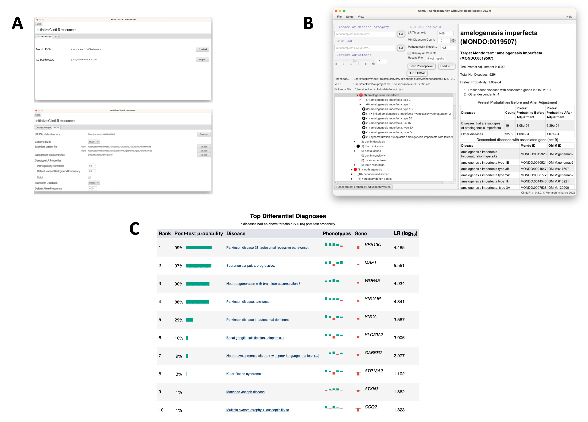

# Tutorial

This tutorial shows how to use ClintLR to perform LIRICAL analysis of phenopackets using adjusted pretest probabilities.


## Exomiser data

ClintLR uses the Exomiser variant database that is available
from the [Exomiser FTP site](http://data.monarchinitiative.org/exomiser/latest/index.html). The versions current as of
this writing are  ```2302_hg19.zip``` (for the HG19/GRCh37 Genome Assembly) and  ```2302_hg38.zip``` (for the HG38/GRCh38 Genome Assembly).
Choose the appropriate genome build, and download and extract the corresponding file.


## Test data

We will use a VCF file that is available in the Exomiser distribution file (e.g., exomiser-cli-13.2.0-distribution.zip),
which is available from the same FTP site.  The file is called ```Pfeiffer.vcf```
and can be found in the ```examples``` folder of the unzipped Exomiser distribution file. This file spikes a pathogenic FGFR3
variant into a public VCF file and can be used to test ClintLR.


## Running ClintLR Analysis

The tree view shows the loaded Mondo ontology. Tree item icons indicate which terms are OMIM (black circle) or OMIMPS (red circle) terms.
You can jump to specific terms in the ontology by using the *Browse Mondo Terms* or *Browse OMIM Terms* search fields.
The Mondo term search field autocompletes the Mondo ontology disease name/label, and the OMIM term search field autocompletes the OMIM term ID.
Information for the selected term is displayed in an HTML window to the right of the tree view.

<figure>
  
  <figcaption>ClintLR (CLinical INTuition with Likelihood Ratios). (A) Users can download input files and adjust settings via the setup interface. (B) The main analysis interface allows users to choose the disease group and adjust the pretest probability of the group to reflect clinical intuition. (C) ClintLR runs LIRICAL with the adjusted pretest probabilities and displays the results in the system browser.</figcaption>
</figure>

Clinical intuition is incorporated into the LIRICAL algorithm by way of a slider in the ClintLR interface.
The slider increases the pretest probability values that get passed into LIRICAL for the selected term and its descendants.
In the tree, an up arrow in the selected term’s icon indicates that the pretest probability has been increased for that term.
The pretest adjustment values can be reset to defaults for all terms by clicking the Reset button below the tree view.
The pretest probability adjustment values can be viewed in a separate interface (*File -> Probability Map -> Show Map Interface*).
If desired, the pretest probability values can be saved as a separate text file (*File -> Probability Map -> Save Map to File*), which can then be imported later.

A phenopacket needs to be loaded (**Load Phenopacket** button) for the LIRICAL analysis to run correctly.
The LIRICAL analysis parameters can be adjusted as well, and the LIRICAL algorithm can be run directly from ClintLR using the **Run LIRICAL** button.
The LIRICAL analysis can be performed using only phenotypic information, or using both phenotypic + genotypic information
by loading a VCF file into ClintLR (**Load VCF** button) and then running LIRICAL.


## Viewing the results

Once the analysis is complete, the results will be written to a new HTML file which is saved to the output directory and
opened in a web browser. The top of the page shows some information about the input files and a list of observed
and excluded HPO terms. The next section shows summarized representations of the top candidates.

Each row in the summary shows the rank, post-test probability, and name/ID of the disease. The row includes a sparkline
representation of the phenotypic profiles of each candidate, with green bars indicating positive contributions and red bars
indicating negative contributions to the diagnosis. The last bar represents the genotype likelihood ratio if LIRICAL was run with
a VCF file. Hovering over the individual bars will show the name of the HPO term or gene, and all sparklines show the terms
in the same order.

LIRICAL then presents a detailed analysis of each of the top candidates. The summary shows information about identified
variants and the phenotypic profile. Hovering over the graphic shows information about the likelihood ratio and the type of the
match.

The remaining part of the HTML output page contains information about the other top candidates and a list of all
diseases analyzed. The bottom of the page includes explanations and documents the settings used for the analysis.


## Analysis Using a List of Genes

The default in the ClintLR GUI is to apply the adjusted pretest probabilities to the selected term and all of its descendants.
Alternatively, there is also a command-line interface where the pretest probability adjustments can be applied to terms based on
a provided list of genes. There is a Python script to facilitate this analysis. The script accepts 6 arguments:

| Flag                    | Multiplicity | Description                                                     |
|-------------------------|--------------|-----------------------------------------------------------------|
| -p or --phenopacket     | 1..*         | Path(s) to phenopacket JSON file(s). REQUIRED.                  |
| -j or --jar             | 1..1         | Path to Java executable JAR file.                               |
| -d or --data            | 1..1         | Path to LIRICAL data directory.                                 |
| -O or --outputDirectory | 1..1         | Path to directory to write the results files.                   |
| -m or --multiplier      | 1..1         | Comma-separated pretest adjustment values (e.g. 5,10,15).       |
| -g or --genes           | 1..1         | Path to file containing a comma-separated list of gene symbols. |


The script can be run using the following command:

  ```python path/to/pythonScript.py -p path/to/phenopacket(s) [-optional additional args]```

The -p argument accepts a list of phenopackets, or a path to a directory that contains the phenopackets to analyze sequentially.

For example, to run analysis on all phenopackets in a directory using pretest adjustment values of 5 and 10 and a genes file,
use the following command:

  ```python path/to/pythonScript.py -p path/to/phenopacket/directory -m 5,10 -g path/to/genesFile.txt```

Individual phenopacket analysis results are saved as TSV files. Additionally, a summary file is created that includes the
posttest probability values and rankings for the target disease at each pretest adjustment value for all phenopackets analyzed.