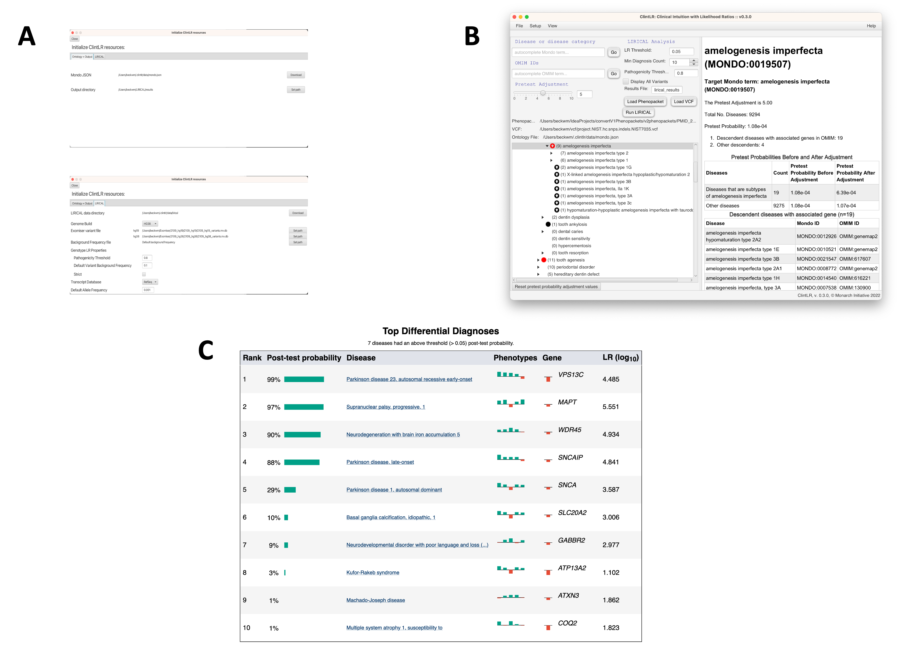

# Tutorial

This tutorial shows how to use ClintLR to perform LIRICAL analysis of phenopackets using adjusted pretest probabilities.


## Exomiser data

ClintLR uses the Exomiser variant database that is available
from the [Exomiser FTP site](http://data.monarchinitiative.org/exomiser/latest/index.html). The versions current as of
this writing are  ```2302_hg19.zip``` (for the HG19/GRCh37 Genome Assembly) and  ```2302_hg38.zip``` (for the HG38/GRCh38 Genome Assembly).
Choose the appropriate genome build, and download and extract the corresponding file.


## Test data

We will use a VCF file that is available in the Exomiser distribution file (e.g., exomiser-cli-13.2.0-distribution.zip),
which is available from the same FTP site.  The file is called ```Pfeiffer.vcf```
and can be found in the ```examples``` folder of the unzipped Exomiser distribution file. This file spikes a pathogenic FGFR3
variant into a public VCF file and can be used to test ClintLR.


## ClintLR Analysis Workflow

### 1. Select diseases

The tree view shows the loaded Mondo ontology. Tree item icons indicate which terms are OMIM (black circle) or 
OMIMPS (red circle) terms.
You can jump to specific terms in the ontology by using the *Browse Mondo Terms* or *Browse OMIM Terms* search fields.
The Mondo term search field autocompletes the Mondo ontology disease name/label, and the OMIM term search field autocompletes 
the OMIM term ID.
Information for the selected term is displayed in an HTML window to the right of the tree view (Figure 1B).

<figure markdown>
  
  <figcaption>Figure 1:
ClintLR (CLinical INTuition with Likelihood Ratios).
(A) Users can download input files and adjust settings via the setup interface.
(B) The main analysis interface allows users to choose the disease group and adjust the pretest probability of the group to
reflect clinical intuition.
(C) ClintLR runs LIRICAL with the adjusted pretest probabilities and displays the results in the system browser.</figcaption>
</figure>


### 2. Apply pretest adjustments to selected diseases

Clinical intuition is incorporated into the LIRICAL algorithm by way of a slider in the ClintLR interface.
The slider increases the pretest adjustment, hereafter referred to as *a*, values that get passed into LIRICAL for 
the selected term and its descendants.
In the tree, an up arrow in the selected term’s icon indicates that *a* has been increased for that term.
The *a* values can be reset to defaults for all terms by clicking the **Reset pretest probability adjustment values** 
button below the tree view.

**Note:** The tree icons do not update automatically. To see icon changes, the tree item must be expanded/collapsed/selected again.

The *a* values can be viewed in a separate interface (*File -> Pretest Adjustment Map -> Show Map Interface*).
If desired, the *a* values can be saved as a separate text file (*File -> Pretest Adjustment Map -> Save Map to File*), 
which can then be imported later (*File -> Pretest Adjustment Map -> Load Map from File*).

### 3. Adjust LIRICAL parameters

ClintLR includes fields for various LIRICAL parameters (Figure 1A and 1B), including the likelihood ratio (LR) threshold,
the pathogenicity threshold, minimum diagnosis count, whether to display all variants, and the name of the results
output file.

Additional LIRICAL parameters are located in the *LIRICAL* tab of the Resources interface. The values for these parameters
are preserved between sessions.

### 4. Load a phenopacket

A phenopacket needs to be loaded (**Load Phenopacket** button) for the LIRICAL analysis to run correctly.

### 5. **Optional:** Load a VCF file

The LIRICAL analysis can be performed using only phenotypic information, or using both phenotypic + genotypic information
by loading a VCF file into ClintLR (**Load VCF** button).

### 6. Run LIRICAL

The LIRICAL algorithm can be run directly from ClintLR using the **Run LIRICAL** button. 

**Note:** There is currently no progress bar for the **Run LIRICAL** button, however the analysis is being run 
in the background.

## Analysis results

Once the analysis is complete, the results will be written to a new HTML file (Figure 1C) and opened in a web browser. 
This HTML file is also saved locally in the output directory specified in the Resources interface.
The top of the page shows some information about the input files and a list of observed
and excluded HPO terms. The next section shows summarized representations of the top candidates.

Each row in the summary shows the rank, post-test probability, and name/ID of the disease. The row includes a sparkline
representation of the phenotypic profiles of each candidate, with green bars indicating positive contributions and red bars
indicating negative contributions to the diagnosis. The last bar represents the genotype likelihood ratio if LIRICAL was run with
a VCF file. Hovering over the individual bars will show the name of the HPO term or gene, and all sparklines show the terms
in the same order.

LIRICAL then presents a detailed analysis of each of the top candidates. The summary shows information about identified
variants and the phenotypic profile. Hovering over the graphic shows information about the likelihood ratio and the type of the
match.

The remaining part of the HTML output page contains information about the other top candidates and a list of all
diseases analyzed. The bottom of the page includes explanations and documents the settings used for the analysis.
